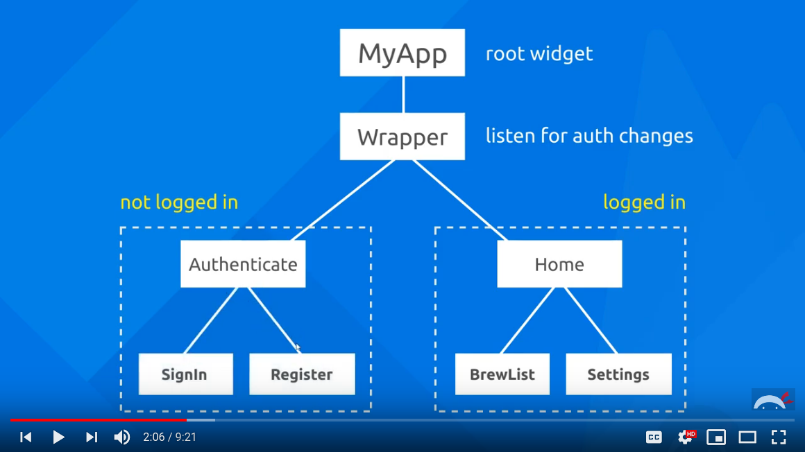

# firebase_tutorial

A new Flutter project.

# Firebase:
* Set up a new firebase project, and link it with an android app (work with the `/android` folder in flutter). Follow along the steps.
* In the firebase console under "Authentication", set up email and anonymous login methods.

# Learnings
* keep models(classes) seperate from the UI files. Also bunch related UI files together.
* We use `Streams` in dart to lisen for changes (eg: listen for change in authentication status in the wrapper). 
    * Each peice of information in a `Stream` in being continually sent. Basically, dont send shit all at once, but send it as and when you recieve it.
* We use the `Provider` package for listening to changes lower in the widget tree from somewhere higher in the widget tree. It is the recommended way for state management in flutter. It is used in the root widget (`main.dart` here)
* Can pass functions to children as parameters, which toggle the parent's state (here, to switch views). For example, check out how register and sign in are switched. There is no `Material.push()` or whatever that is, to manually push/pop a page from the stack. It's all handled by a parent class controlling both the states.
* We are also use another stream from firebase, which notifies us of and document/document changes that happen in our database. We user `Provider` again, in the `home.dart` (the homepage)
* getters are usually used for stream definition, so other classes just call this getter.
* make sure streams are getting updated with the data they are listening to changes for
* Can actually have more than 1 emulator running, with each acting as a seperate user.

# TODO: remove api key from `android/app/src/main/AndroidManifest.xml`

# Login process

# References
* [Hot reload on multiple devices](https://stackoverflow.com/a/58355638)
* [Pass provider state to another route](https://stackoverflow.com/a/57915045)
* [Circular button](https://stackoverflow.com/a/51117463)
* [Adding assets](https://flutter.dev/docs/development/ui/assets-and-images)
* [Get directions from A to B in google maps](https://medium.com/flutter-community/drawing-route-lines-on-google-maps-between-two-locations-in-flutter-4d351733ccbe)
* [Making a page scrollable](https://stackoverflow.com/a/51773359)
* [Push notifications with flutter](https://www.youtube.com/watch?v=Lq9-DPKWtIc). Can send notification on firebase console > Cloud messaging
* [Firebase puch notification to custom user](https://www.youtube.com/watch?v=2TSm2YGBT1s). Seems to use Typescript to define a custom cloud function. Unnessessarily complicated.
